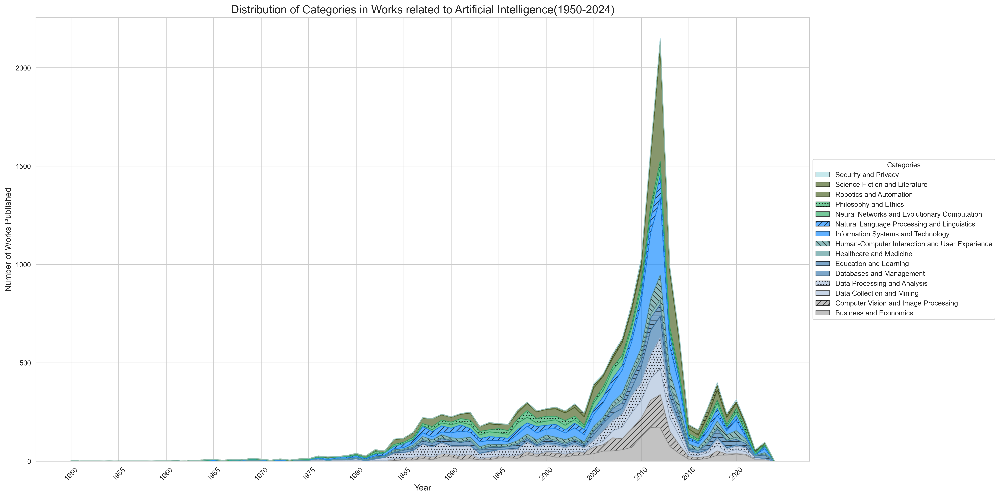
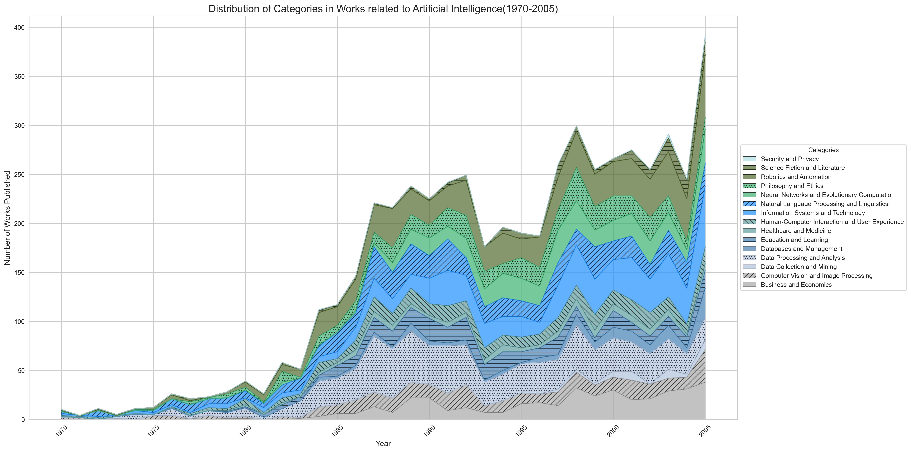
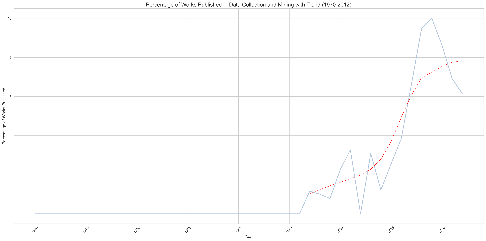
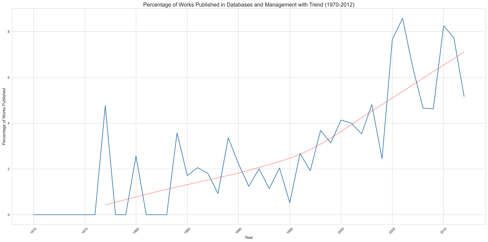

# 🔹🔷Datatonic Challenge🔷🔹
Thank you for inviting me to complete this Challenge! 

Below is an overview of all the parts of the challenge, and my thinking associated with them.
I will also give an overview of the insights I collected in Part 3.

## Part 1 - Lord of the Rings 💍🌋
I approached this part by including books which had `"lord of the rings"` in the title, rather than explicitly being called `"lord of the rings"`.

**Some of the data considerations addressed during pre-processing:**
- Excluding books which had similar titles like "lords of the ring"
- Including only the earliest date of publication on books to reduce clutter in the date column of the CSV
- Only including works which had formats associated with books, due to a large amount of video games, movies, and CDs being included in the API response
    - ex. *Paperback, Hardcover, Binding, etc.*
- Excluding books which did not have an author listed, which mostly removed duplicates of books found in the API response

**Data about the books added to the CSV:**
- Title
- Author(s)
- Publish Year
- Publisher(s)
- Language

## Part 2 - Artificial Intelligence (AI) 🤖🧠
Here I made use of the [Subjects API](https://openlibrary.org/dev/docs/api/subjects) to create a dataset of works which tagged `"artificial intelligence"` as one of their associated subjects.

**Data about the books added to the CSV:**
- Title
- Author(s)
- Publish Year
- Subjects

## Part 3 - Insights 🧮📊
Using the CSV created in the previous step, I wanted to get insights on the growth and popularity of subjects associated with AI. 

I split up the data into 15 groups, and assigned subject keywords associated with the groups. 

**These groups were:**
1. Business and Economics
2. Computer Vision and Image Processing
3. Data Collection and Mining
4. Data Processing and Analysis
5. Databases and Management
6. Education and Learning
7. Healthcare and Medicine
8. Human-Computer Interaction and User Experience
9. Information Systems and Technology
10. Natural Language Processing and Linguistics
11. Neural Networks and Evolutionary Computation
12. Philosophy and Ethics
13. Robotics and Automation
14. Science Fiction and Literature
15. Security and Privacy

**Some of the data considerations addressed while generating insights:**
- Excluding works published before 1950 to remove works with incorrect publish dates
  - *The earliest verifiable work associated with AI available on OpenLibrary is I, Robot by Isaac Asimov published in 1950*
  - ex. *Neural network research papers incorrectly stating they were published in 1899*
- Not considering works published after 2012 because this data skews the analysis of AI subject growth
  - *The number of works available on OpenLibrary across all subjects and fields drops drastically after 2011/2012, resulting in unreliable trends*
    
    

    Figure 1: *Number of works published in each group by year (1950-2024) showcasing a large dropoff in publications after 2012*
- Omitting the use of an "Other" group in the grouping of data to better showcase trends in selected groups

### Insights
Most insights use 1970–2012 as their timeframe. Insights from before 1982, particularly those examining percentage distributions, often show significant variations due to the limited number of publications available (see Figure 6). This is why insights for 1982–2012 were also generated. Overall, these insights employ various time windows to better illustrate specific trends.

Below is a collection of interesting insights gathered from the dataset created in Part 2.

---

#### The Popularity of AI Over Time

AI's popularity has evolved significantly over the decades, as measured by the number of works published each year. Various trends highlight the field's growth and challenges.

Some key trends identified:

- AI began to gain traction in the early 1960s, leading to a significant surge of interest approaching the 1980s (Figure 3)
- Interest in AI continued to grow through the 1980s, reaching a peak in the early 1990s (Figure 4)
- The early 1990s saw an [AI winter](https://en.wikipedia.org/wiki/AI_winter#The_setbacks_of_the_late_1980s_and_early_1990s), resulting in decreased interest in AI (Figure 4)
- After 2005, AI's popularity began to [resemble exponential growth](https://www.reddit.com/r/singularity/comments/xwdzr5/the_number_of_ai_papers_on_arxiv_per_month_grows/)

Figure 2: *Number of works published in each group by year (1970-2012) showing the popularity of AI over time*

Figure 3: *Number of works published in each group by year (1950-1982) showcasing the early growth of AI*

Figure 4: *Number of works published in each group by year (1970-2005) showcasing the growing popularity of AI in the 1980s and the AI winter of the 1990s*

---

#### Trends in the Popularity of Subjects within AI
Percentage distribution is used as a measure because AI is an expanding field, and the number of publications across all AI subjects is increasing at different rates. 
A percentage distribution provides a more accurate indication of the relative popularity of specific subjects at various points in time.

Some interesting trends identified:
- The use of AI within Security is a growing field, starting in the late 1990s (Figure 7)
- The use of AI for Datamining was really popular in the late 1990s / early 2000s, but is seeing a dropoff in popularity (Figure 8)
- The use of AI for Database Management has seen a continuously growing popularity since the 1980s (Figure 9)
- Work on Neural Networks was very popular in the 1990s, but has since dropped off (Figure 10)
- Philosophical work on AI was very popular in the 1990s, but has since dropped off (Figure 11)
- Science Fiction / Literature about AI was really mainstream in the early 2000s, but has since dropped off (Figure 12)
- Natural Language Processing (NLP) and Linguistics has seen a decline in popularity since its peak in the 1970s (Figure 13)
- Computer Vision and Image Processing has seen a decline in popularity since its peak in the 1970s (Figure 14)

It's important to note that these trends in AI subject popularity do not directly reflect the current usage or discussion of these topics. Instead, they highlight periods when significant work was conducted on certain topics. 

For example, even though Natural Language Processing (NLP) and Computer Vision are experiencing a decline in publication popularity in relation to other subjects, this does not imply they are less used in AI today. 
These areas remain fundamental concepts in AI. The trends indicate when these subjects were most actively researched or discussed in academic and professional circles.

Figure 5: *Percentage Distribution of AI Subjects (1982-2012)*

Figure 6: *Percentage Distribution of Categories in Works related to AI (Pre-1982)*

Figure 7: *Percentage Distribution of Works Published in Security and Privacy with trend line (1970-2012)*

Figure 8: *Percentage Distribution of Works Published in Data Collection and Mining with trend line (1970-2012)*

Figure 9: *Percentage Distribution of Works Published in Databases and Management with trend line (1970-2012)*

Figure 10: *Percentage Distribution of Works Published in Neural Networks and Evolutionary Computation with trend line (1970-2012)*

Figure 11: *Percentage Distribution of Works Published in Philosophy and Ethics with trend line (1970-2012)*

Figure 12: *Percentage Distribution of Works Published in Science Fiction and Literature with trend line (1982-2012)*

Figure 13: *Percentage Distribution of Works Published in Natural Language Processing and Linguistics with trend line (1970-2012)*

Figure 14: *Percentage Distribution of Works Published in Computer Vision and Image Processing with trend line (1970-2012)*

